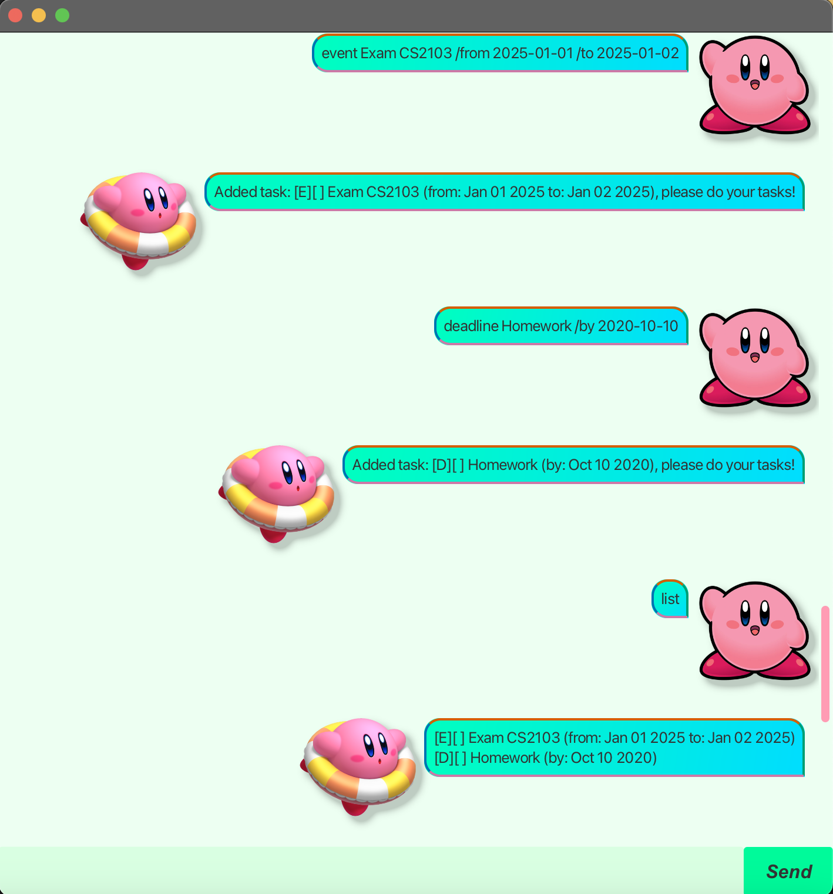
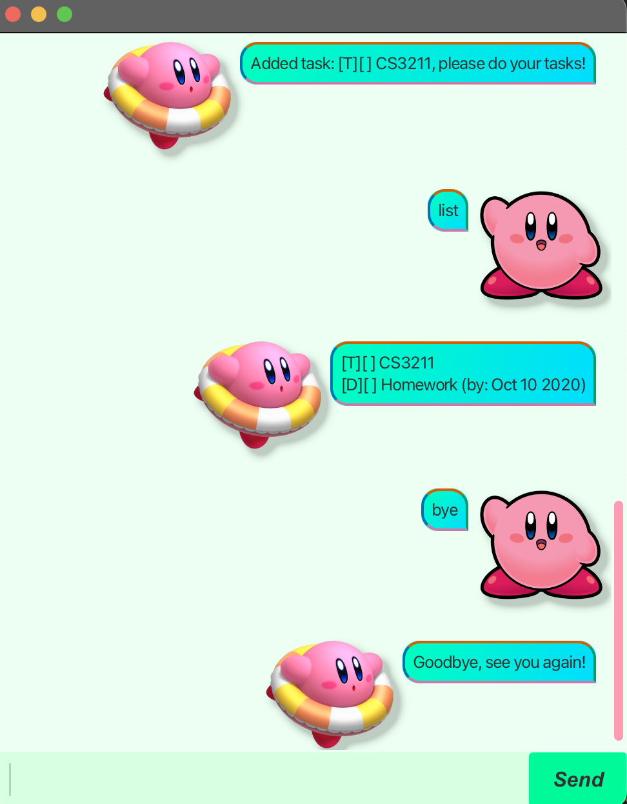

# EryzBot User Guide

## Introduction
EryzBot is a task management bot designed to help you stay on top of your to-do list. It allows you to manage tasks by adding, marking, unmarking, deleting, and searching tasks with ease. The bot is fully integrated with a storage system that persists your tasks even after you close the app.

We keep you on track, and simplifies task management like never before!

## Adding Deadlines

You can add deadlines by typing a command with a specific format. The task will be added to your task list, and a deadline will be associated with it.

### Command Syntax:
`deadline <task name> /by <YYYY-MM-DD>`

### Example:
`deadline Finish project report /by 2025-02-28`

### Expected Outcome:
The task "Finish project report" will be added with a deadline on February 28, 2025. The task will appear in your list, marked as a Deadline task.
`[D] [ ] Finish project report (by: 2025-02-28)`

## Marking Tasks

To mark a task as completed, simply use the `mark` command followed by the task number.

### Command Syntax:
`mark <task number>`

### Example:
`mark 1`

### Expected Outcome:
The task with the specified number will be marked as completed, and the status will be updated.
`[D] [X] Finish project report (by: 2025-02-28)`

## Searching Tasks

EryzBot allows you to search for tasks by keywords. You can find tasks that contain a specific keyword in their name.

### Command Syntax:
`find <keyword>`

### Example:
`find report`

### Expected Outcome:
EryzBot will return a list of tasks containing the keyword "report"
`[D] [ ] Finish project report (by: 2025-02-28) [T] [X] Submit annual report`

## Deleting Tasks

To delete a task from the list, use the `delete` command with the task number.

### Command Syntax:
`delete <task number>`

### Example:
`delete 2`

### Expected Outcome:
The task with the specified number will be deleted from the list.
`Deleted task 2: [T] [X] Submit annual report`

## Unmarking Tasks

If you wish to mark a completed task as not completed, use the `unmark` command.

### Command Syntax:
`unmark <task number>`

### Example:
`unmark 1`

### Expected Outcome:
The task will be unmarked, and the status will be updated.
`[D] [ ] Finish project report (by: 2025-02-28)`

## Additional Features
- **Exit Command**: Type `bye` to exit the application.
- **List Tasks**: Use the `list` command to display all tasks in your task list.

## Sample GUI Screenshots
Here are some example screenshots of EryzBot :  
  

## Troubleshooting & Additional Notes

If you encounter any issues with task handling or commands, feel free to consult the **Help** section or contact support at [gabriella@u.nus.edu](mailto:gabriella@u.nus.edu).

---

